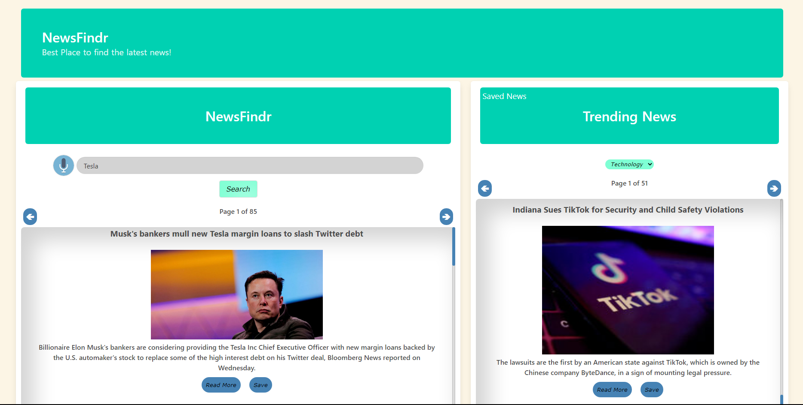

# NewsFindr

## Description

NewsFindr is a news aggregator that allows users to search for news articles or search for trending news articles by category and displays the results in a clean and easy to read format with links to read more. Users can also save articles and view them at a later time.




## User Story

```
AS A user
I WANT an application that displays news articles
SO THAT I can keep up to date with the latest news
```

```
GIVEN a webpage that allows me to search for news
WHEN I type in a news subject
THEN I am presented with top news results related to that subject
WHEN I want to see top global news
THEN I can see the populated area of the page with trending news results
WHEN I am unable to type and want to say what i am looking for
THEN I click a button that translates my speech to text
WHEN I want to store an article I am interested in
THEN I can save it so it can be viewed later
```

## Usage

Click on the link below to view the deployed application
https://omalleyjg.github.io/NewsFindr/

```
 Voice search is only available on chrome browser
 Text input field to search for articles by keyword
 Category dropdown to search for trending articles by category
 Click the arrow buttons to cycle through pages to view more related articles 
 Click a read more to view the article in the original source
 Click the save button to save articles for later viewing
 Click saved news to view saved articles
 Click the delete button to delete saved articles
```

## Features

```
 Search for news articles by keyword
 Search for news articles by category
 View articles in a clean and easy to read format
 View article in original source 
 Save articles for later viewing
 Cycle through pages to view more related articles
 View saved articles
```

## Credits

James O'Malley
https://github.com/omalleyjg

Ryan Stanton
https://github.com/Ryguy506

Jayasree Ragou
https://github.com/jayasreeyuvi

Jeremy Thomas (Bulma Framework Creator)
https://github.com/jgthms


## Apis

https://wicg.github.io/speech-api/ (Web Speech API)

https://newsdata.io/ (News API)

https://rapidapi.com/contextualwebsearch/api/web-search (Web Search API/News API)

## License

MIT License

Copyright (c) [2022] [James O'Malley]

Permission is hereby granted, free of charge, to any person obtaining a copy of this software and associated documentation files (the "Software"), to deal in the Software without restriction, including without limitation the rights to use, copy, modify, merge, publish, distribute, sublicense, and/or sell copies of the Software, and to permit persons to whom the Software is furnished to do so, subject to the following conditions:

The above copyright notice and this permission notice shall be included in all copies or substantial portions of the Software.

THE SOFTWARE IS PROVIDED "AS IS", WITHOUT WARRANTY OF ANY KIND, EXPRESS OR IMPLIED, INCLUDING BUT NOT LIMITED TO THE WARRANTIES OF MERCHANTABILITY, FITNESS FOR A PARTICULAR PURPOSE AND NONINFRINGEMENT. IN NO EVENT SHALL THE AUTHORS OR COPYRIGHT HOLDERS BE LIABLE FOR ANY CLAIM, DAMAGES OR OTHER LIABILITY, WHETHER IN AN ACTION OF CONTRACT, TORT OR OTHERWISE, ARISING FROM, OUT OF OR IN CONNECTION WITH THE SOFTWARE OR THE USE OR OTHER DEALINGS IN THE SOFTWARE.

## Badges


